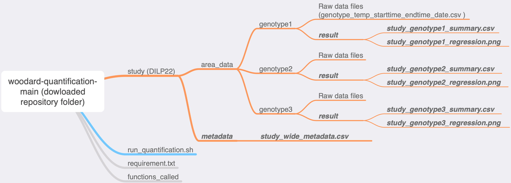

# Fat Body Dissociation Quantification

By Jennie Li from Woodard Lab 

This repo contains the manuscripts and codes for quantitative assessment of _Drosophila_ fat body dissociation. 

## Step 1: ImageJ 
### Set up 
1. Download [ImageJ](https://imagej.nih.gov/ij/download.html).
2. Open the microscopy image in ImageJ.

### Calibrate using scale bar 
1. Select "Straight" tool from the tool bar (looks like a line). Draw a line on top of the scale bar (hold Shift to draw a perfect straight line). 
2. Go to "Analyze" - "Set Scale". "Distance in pixels" is the length of the scale bar regarding to the image. In "Known distance", enter the actual distance (E.g. 500). You can change the "Unit of length" to the unit of actual distance (E.g. um). Click "OK". 

### Thresholding 
1. In the tool bar, select "Rectangle". Then use mouse to select the portion of image for analysis, excluding the scale bar or any other labels. Go to "Image" - "Duplicate", and create a new image without any unwanted text. 
2. Go to "Image" - "Type“ - select "8-bit". 
3. Go to "Image" - "Adjust" - "Thresholding". 
4. Drag the first slide bar to adjust the threshold. The red color represents selected area. Make sure the red color nicely covers the particles. 
5. Click "Apply". 
	
### Determine area 
1. Now you get a black & white image with only the particles you selected. 
2. Go to "Analyze" - "Analyze particles". 
3. Click "OK". 
4. Save the output file. Rename it in the following formate and save as .csv file: 
	+ genotype_temperature_starttime_endtime_date
	+ E.g. WT_25c_0905_1755_20220207
	+ DO NOT include space or extra underscore
5. These csv files, generated from your microscopy images, are the files used for the following quantification analysis. No need to save other files. 

### Resources for ImageJ
+ [This tutorial](https://www.youtube.com/watch?v=FiFwxoxOmNo&t=826s) is a good demonstration of some features of ImageJ, although it is not tailored to serve our purpose of area quantification. 
  + 1:46 - 4:56 Calibration 
  + 8:35 - 16:08 Thresholding and Measure Area 


## Step 2: Python Script

NOTICE: In this version, Visual Studio Code is no longer needed. 

1. Download the repository folder to your local computer. Click the green button "Code" on the upper right corner of this git hub page - "Download ZIP". 
2. Open **terminal**. Type "cd", type a space, then drag the downloaded repository folder "woodard-lab-fat-body-dissociation-quantification" into terminal. After, you should see one line like below (the exact path might differ depending on your folder location). 
	```
	$ cd  /Users/test/woodard-lab-fat-body-dissociation-quantification
	``` 
	Then type enter/return to execute the line of command. 
3. Type or copy the following command to install required packages: 
	```
	pip install -r requirement.txt
	``` 
4. Organize raw csv files into genotype subfolders, and then into a folder as indicated in the diagram. Name the folder as your study name. Put the folder inside the repository folder. 
   

5.  Go to **terminal**. The script takes one argument - the study name. 
	```
	bash run_quantification.sh STUDY
	``` 
	The study name should be the name of the folder containing raw data organized in specific way (as indicated in the diagram above). For instance, to run analysis on demo study named `DILP22`, type and enter: 
	```
	bash run_quantification.sh DILP22
	``` 
	When the program runs, you will be informed by the messages printed in the terminal. 
6. Results will be generated and can be found in your study folder. In the diagram the outputs are ***bolded and italicized***. 
    * "metadata" folder containing "study_wide_metadata.csv", which is a summary of all data in the study. 
    * each genotype folder will have a subfolder "results" containing a linear regression plot and a summary for the genotype. 

